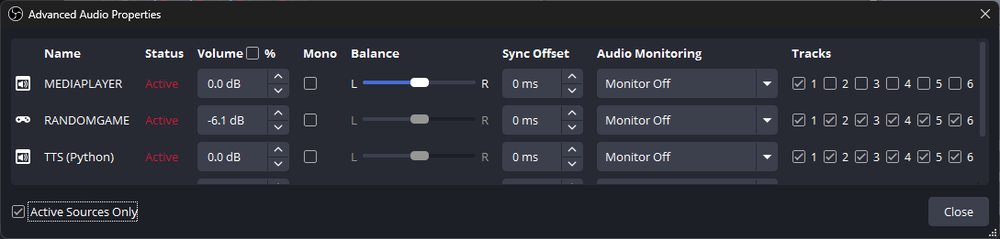
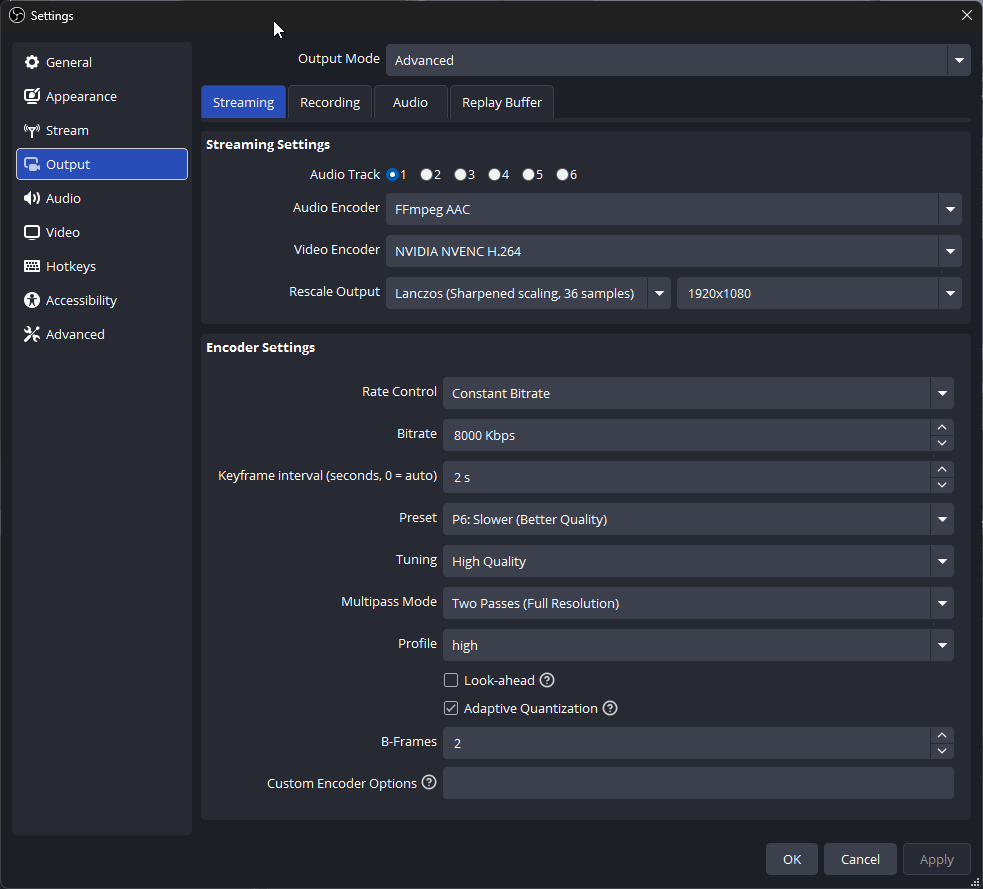
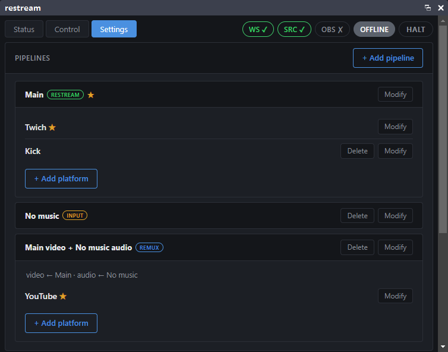
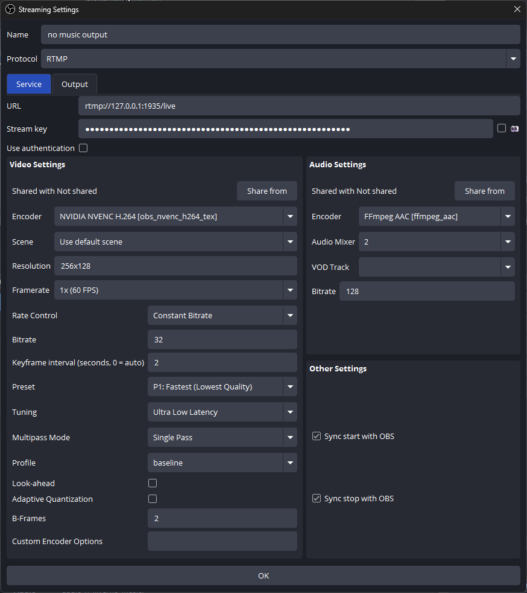
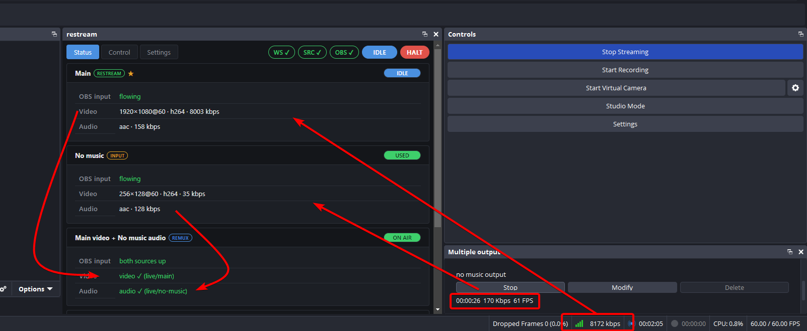

# Remux: send a different audio mix to one platform

This guide shows how to send **one platform a stream with a different audio mix** than the others — the worked example is **music‑free audio to YouTube** (to avoid copyright strikes) while **Twitch and Kick still get the full mix with music**.

The trick: you don't upload a second full‑quality video. You upload only a **tiny extra stream that carries the alternative audio** (~150–250 kbps), and the VPS **remuxes** it — video from your main stream + audio from the extra one, with `-c copy` (no re‑encoding). So your uplink stays ~8 Mbps + a few hundred kbps, not 2×8 Mbps.

## Goal — minimise your uplink

You don't strictly need remux for this. obs‑multi‑rtmp can send a **second full output** (full video + the music‑free audio) — either into a separate `restream` pipeline on the VPS (so YouTube also gets the backup‑video/continuity this controller provides), or **straight to YouTube** if you don't need a backup at all. Either way it just works. The catch is bandwidth: that's **two full video streams** leaving your PC (~2× your video bitrate), which most home uplinks can't sustain alongside everything else.

Remux exists purely to avoid that. Instead of a second full video, you upload only the alternative **audio** and let the VPS pair it with the main video it already receives (`-c copy`, no re‑encode). The result on YouTube is identical, but the PC→VPS uplink stays roughly **8 Mbps + a few hundred kbps** instead of **~2×8 Mbps**. If your uplink is generous and you'd rather keep it simple, the plain second‑full‑output approach is a perfectly fine alternative.

---

## How it works

Three pieces on the VPS side (all created in the dashboard):

| Pipeline | Type | Role |
|---|---|---|
| **Main** | `restream` | Your normal stream **with music** → Twitch, Kick. |
| **No music** | `input` | A named ingest that receives the **music‑free audio** feed. No platforms of its own — it's only a source. |
| **Main video + No music audio** | `remux` | Takes **video from `Main`** + **audio from `No music`**, `-c copy`, → YouTube. |

On the OBS side you produce two outputs:

- Your **main output** (video + full audio, track 1) → `Main`.
- A **second, tiny output** via the **obs‑multi‑rtmp** plugin that carries a minimal video + the **music‑free audio** (track 2) → `No music`.

The remux drops the tiny video and keeps only its audio, pairing it with the main video. Result on YouTube: your real video + voice/game audio, no music.

> The same recipe makes **any** alternative mix — commentary‑only, a feed without a particular source, an alternate language, etc. Route the sources to a second audio track, publish that track through a multi‑rtmp output into an `input` pipeline, and remux it onto the main video.

**Prerequisite:** the [obs‑multi‑rtmp](https://github.com/sorayuki/obs-multi-rtmp) plugin, on a version that lets you pick a **separate encoder and audio mixer per output** (recent versions do).

---

## Step 1 — Split your audio into two tracks in OBS

Open **Audio Mixer → ⋮ → Advanced Audio Properties** and use the **Tracks** column to decide which source goes to which track.

Put **music on track 1 only**, and everything else on **both track 1 and track 2**:

In the example above:

- `MEDIAPLAYER` (the music) → **track 1 only**.
- `RANDOMGAME`, `TTS` → **tracks 1 and 2**.

So:

- **Track 1** = music + game + TTS → the **full mix** (goes to Twitch/Kick).
- **Track 2** = game + TTS, **no music** → the mix that goes to YouTube.

---

## Step 2 — Main output uses track 1 (with music)

**Settings → Output** (Output Mode: **Advanced**), **Streaming** tab: set **Audio Track = 1** and your normal video encoder.

Only two things here matter for remux — everything else is just your usual main‑stream config:

- **Audio Track = 1** (the full mix, with music).
- **Keyframe interval: 2 s** — keep it fixed and below the controller's *connect timeout*. (The rest — **CBR** with an explicit **Bitrate**, encoder, resolution — is your normal stream setup, shown here only for reference.)

Point OBS at the **Main** pipeline the usual way — **Settings → Stream → Service: Custom**, and paste the **Server + Stream Key** from the dashboard (**Settings → Main → Modify → “OBS output for this pipeline”**).

---

## Step 3 — Create the `No music` input in the dashboard

In the dashboard **Settings** tab, click **+ Add pipeline**, choose type **Input**, name it (e.g. `No music`), and confirm. Open it with **Modify** — it shows only a name and its **OBS output (Server + Stream Key)**. Keep that dialog handy: you'll paste those two values into the plugin in the next step.

> An `input` has no platforms and no backup of its own — it's purely a source for a remux. Its badge is **USED** when a remux consumes it, **IDLE** when nothing references it.

---

## Step 4 — Second output (music‑free audio) via obs‑multi‑rtmp

Open the **Multiple output** dock (obs‑multi‑rtmp) → **Add new target**:

Settings that matter:

- **URL / Stream key** — the **Server** and **Stream Key** from the `No music` input (Step 3). In the screenshot: `rtmp://…:1935/live` + the input's key.
- **Audio → Audio Mixer: 2** — this is the whole point: **track 2 = no music**.
- **Audio → Encoder: AAC**, ~128 kbps.
- **Video** — make it **tiny and cheap**: e.g. **256×128**, low fps, **CBR ~32–100 kbps**. On the VPS this video is **thrown away** (only the audio is used), so quality/bitrate don't matter — keep the uplink and CPU/GPU load minimal. `Ultra Low Latency` / `baseline` (or an **x264 `ultrafast`** encoder if you'd rather not open a second NVENC session).
- **Keyframe interval: 2 s.** The clean video is discarded on the VPS, so its quality is irrelevant — but the keyframe interval sets how much backlog MediaMTX replays to a fresh reader on reconnect, i.e. the length of the brief audio gap when this output re‑enables. A short interval (~2 s) keeps that gap small; it isn't otherwise critical.
- **Other Settings → ✅ Sync start with OBS** and **✅ Sync stop with OBS** — **required.** If the extra output isn't tied to OBS start/stop, its timestamps drift away from the main stream and the remux audio won't line up.

The plugin cannot publish audio‑only (it's an OBS *output*, it needs a video encoder) — that's why we send a minimal video and discard it on the VPS.

---

## Step 5 — Create the remux pipeline

Back in the dashboard **Settings** → **+ Add pipeline** → type **Remux** → name it (e.g. `Main video + No music audio`). It's created, and its edit dialog opens automatically. Set:

- **Video source → `Main`** (its video is used).
- **Audio source → `No music`** (its audio is used).
- **Backup video path** — defaults to the Main pipeline's backup; leave or change it.

Then **+ Add platform** and add **YouTube** as its primary (Server + Stream Key from YouTube). Finally, on the **Control** tab, turn the pipeline's master switch **on** and enable the YouTube platform.

---

## Step 6 — Go live and verify

Press **Start Streaming** in OBS. Because *Sync start with OBS* is on, the `No music` output starts at the same moment.

On the dashboard **Status** tab you should see all three pipelines healthy. The arrows trace where each OBS output goes and how they merge into the remux that streams to YouTube:

- **Main** — `OBS input: flowing`, full video + audio (e.g. 1920×1080@60 · 8003 kbps, aac 158 kbps).
- **No music** *(INPUT)* — badge **USED**, `flowing`, tiny video + aac 128 kbps (~170 kbps total — that's the entire extra uplink cost).
- **Main video + No music audio** *(REMUX)* — badge **ON AIR**, `both sources up`, `video ✓ (live/main)`, `audio ✓ (live/no-music)`.

YouTube now receives your real video with the **music‑free** audio; Twitch and Kick receive the **full** mix.

---

## Audio sync (lip‑sync) calibration

The VPS aligns the two feeds automatically (it measures the offset and keeps it, correcting slow drift on its own). What it **cannot** know is the small, constant difference in end‑to‑end latency between your two OBS encoders — if you notice the YouTube audio slightly leads or lags the video, correct it once by hand:

- Open the remux pipeline → **Modify** → **Audio trim (ms)**.
- Nudge it while watching the stream (negative = audio earlier, positive = later). It **applies live** and is **saved** — the value stays valid across sessions and reconnects (it depends on your encoder setup, not the session).

If the sources' audio/video parameters are similar and both encoders have comparable latency, you'll likely leave it at **0**.

---

## Troubleshooting

- **Audio out of sync after you toggle the plugin output.** Make sure **Sync start/stop with OBS** is enabled on the `No music` output. A brief audio gap right after a re‑enable is normal — the VPS drops the reconnect backlog and re‑locks sync at the live edge.
- **Remux stuck on the backup video.** The remux needs **both** sources up. If the `No music` input is OFFLINE, check the plugin output is running and its URL/key match the input. If `Main` is down, the whole session is down.
- **YouTube says “no data”.** Confirm the remux is enabled (Control master switch) and the YouTube platform is enabled, and that Server/Key are correct.
- **Keep both keyframe intervals at 2 s** and use **CBR**. Variable bitrate or a long keyframe interval can hurt the seam behaviour and reconnect timing.
- **Second NVENC session fails.** Some GPUs limit concurrent NVENC sessions — use an **x264 `ultrafast`** encoder for the tiny `No music` output instead.
