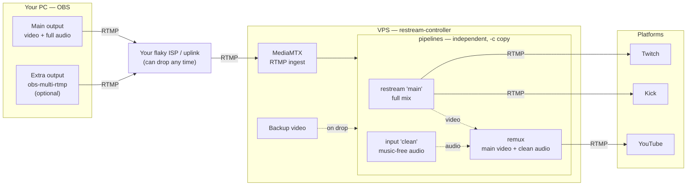

# restream-controller

OBS publishes **1+ RTMP streams** to the VPS; the controller relays each to its platforms with `-c copy` (no re-encoding) and switches to a **backup video** if your connection drops. Usually it's one stream in, fanned out to several platforms; with [multiple pipelines](Doc/Setup/Setup.md#multiple-pipelines-different-feeds-to-different-platforms) / [remux](Doc/Remux/Remux.md) it can be several in and several out (e.g. a music-free feed just for YouTube). *(Diagram renders on GitHub.)*

Continuous OBS -> multi-platform restreaming: publish once from OBS and relay to one **primary** platform plus any number of extra **restream** platforms (Twitch, YouTube, Kick, …). If your internet connection drops, the stream doesn't end — it switches to a backup video until the connection comes back (or until a timeout is reached).

## What it does

`restream-controller` sits between OBS and your streaming platforms on a VPS you control. OBS publishes to the VPS over RTMP; the VPS relays it to each enabled platform. As long as the RTMP connection between the VPS and a platform stays open, that platform keeps the channel live — even while your own connection to the VPS is down.

- **One primary + live-toggleable restreams.** The primary platform is always configured; extra platforms are a list you can turn on and off **live** from the dashboard's Control tab, without restarting anything and without interrupting the platforms already streaming. Want to send content to Kick but not Twitch for a while? Just uncheck Twitch.
- **Seamless fallback.** If OBS disconnects unexpectedly (bad internet, crashed PC, closed OBS), the stream switches to a backup video instead of ending. Viewers on every enabled platform see a placeholder, not a "stream offline" screen.
- **Seamless recovery.** When OBS reconnects, the service waits for a clean keyframe from the live feed and cuts back to it without ever dropping the platform connections — no visible freeze, no re-buffering.
- **A slow/broken platform never affects the others.** Each platform has its own output pipeline; if one can't keep up or its key is wrong, it retries (or stops) on its own while the rest keep streaming.
- **Aggregate failsafe.** The broadcast is stopped hard (and OBS is told to stop) only if **none** of the enabled platforms can be reached at the start — a wrong key on one platform, while others connect, just drops that one.
- **Graceful stop, not just a timeout.** Consciously clicking "Stop Streaming" in OBS ends the broadcast immediately and cleanly, with no backup video and no waiting around — detected automatically by an invisible OBS Browser Source, no button to click.
- **Automatic timeout.** If the connection doesn't come back within a configurable window (30 minutes by default), the broadcast ends on its own instead of looping the backup video forever.
- **Multiple independent feeds (pipelines), optional.** By default there's one feed fanned out to all platforms. When some platforms need a *different* stream — e.g. Twitch with music but a clean, copyright-safe YouTube feed — you can add extra **pipelines**, each with its own OBS ingest path, its own backup, and its own set of platforms. Each pipeline is an independent stream with its own fallback/continuity. See [Multiple pipelines](Doc/Setup/Setup.md#multiple-pipelines-different-feeds-to-different-platforms).
- **Remux: a different audio mix on one platform, without a second video uplink.** When a platform needs different audio (e.g. music-free audio for YouTube to dodge copyright), the VPS pairs your main video with a separate low-bitrate audio feed (copy-only, no re-encode) - so you upload only the alternative audio, not a whole second stream. See [Remux](Doc/Remux/Remux.md).
- **No Docker, no heavy dependencies.** `ffmpeg` for relaying, a single Go binary ([MediaMTX](https://github.com/bluenviron/mediamtx)) for RTMP ingest, and a stdlib-only Python controller.

Everything is relayed with `-c copy` (no re-encoding on the VPS): every platform gets exactly the bitrate/codec OBS produces. This is a focused tool, not a general platform — no transcoding ladder, no per-platform resolution. One OBS output fanned out to several destinations (or a few independent feeds, one per pipeline), kept alive through drops.

## Documentation

- **[Setup & operation](Doc/Setup/Setup.md)** - prerequisites, install, configuring platforms and OBS, multiple pipelines, and day-to-day management.
- **[Remux](Doc/Remux/Remux.md)** - send a different audio mix to one platform (e.g. music-free audio to YouTube) without doubling your uplink.
- **[Everyday scenarios](Doc/Scenarios/Scenarios.md)** - how the service behaves in common situations (drops, wrong keys, deliberate stop, mid-stream changes).
- **[Troubleshooting](Doc/Troubleshooting/Troubleshooting.md)** - when something misbehaves.
