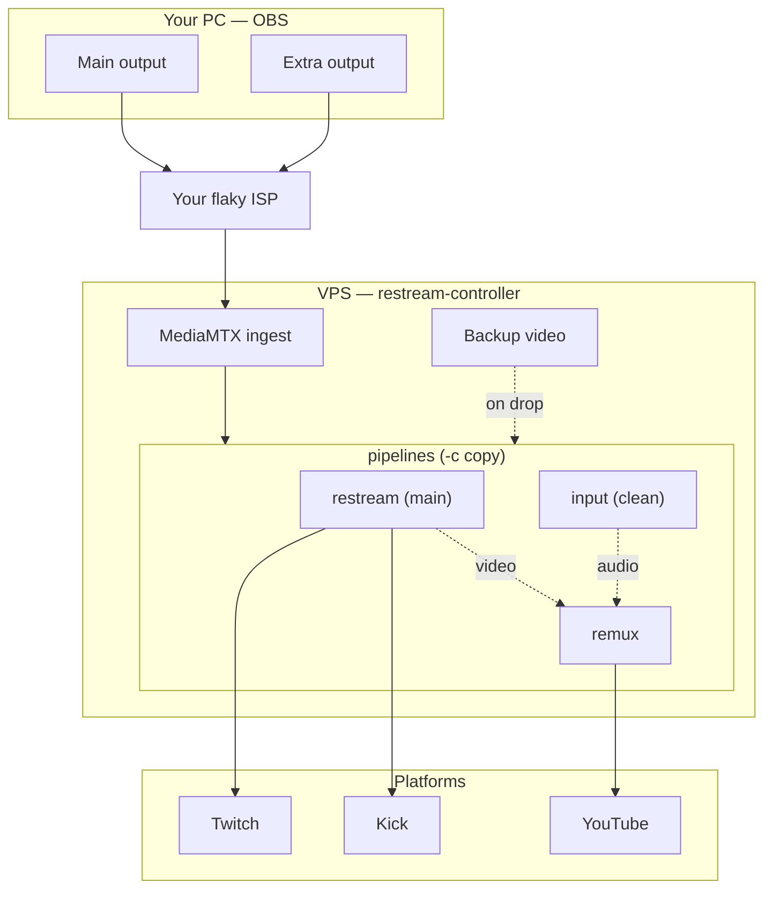

# restream-controller

Continuous OBS -> multi-platform restreaming: publish once from OBS and relay to one **primary** platform plus any number of extra **restream** platforms (Twitch, YouTube, Kick, …). If your internet connection drops, the stream doesn't end — it switches to a backup video until the connection comes back (or until a timeout is reached).

## Documentation

- **[Overview - what it does](Doc/Overview/Overview.md)** - what the service does and its key features.
- **[Setup & operation](Doc/Setup/Setup.md)** - prerequisites, install, configuring platforms and OBS, multiple pipelines, and day-to-day management.
- **[Remux](Doc/Remux/Remux.md)** - send a different audio mix to one platform (e.g. music-free audio to YouTube) without doubling your uplink.
- **[Everyday scenarios](Doc/Scenarios/Scenarios.md)** - how the service behaves in common situations (drops, wrong keys, deliberate stop, mid-stream changes).
- **[Troubleshooting](Doc/Troubleshooting/Troubleshooting.md)** - when something misbehaves.
